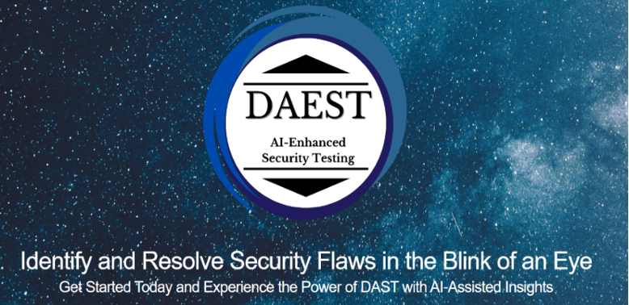
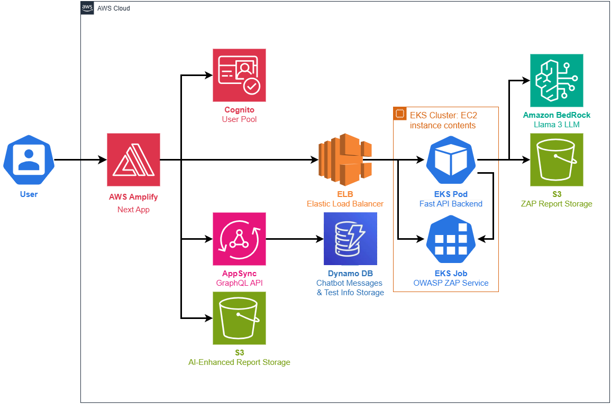

  

    <em>Run AI-enhanced security scans in the cloud with zero setup. Launch tests, analyze results, and get remediation advice in one interface. No local tools, no manual triage, fully automated and accessible from anywhere.
    </em>

    <em> This project was developed through a collaboration between the UBC Cloud Innovation Centre (CIC) and Amazon Web Services (AWS)
    </em>

    
    
    

  

   

## **What is DAEST?**

DAEST is an AI-enhanced security testing platform for web applications. It automates vulnerability scanning using OWASP ZAP and layers on AI-driven analysis to generate clear, actionable security reports. Built on AWS infrastructure with containerized workflows and LLM integration, DAEST streamlines the entire testing process from scan execution to result interpretation through a unified, scalable web interface.

You can think of DAEST as a modern interface for automated security testing workflows enhanced with LLM reasoning. It provides a secure frontend for launching tests, integrated chat-based reporting, and a modular backend architecture designed for cloud-native deployment.

DAEST is especially useful when:

- You want to simplify black-box security testing without losing transparency
- You need to generate human-readable vulnerability reports from raw scan data
- Your team lacks deep security expertise but needs clear mitigation guidance
- You are building developer-facing security workflows that need to scale
- You want to combine OWASP ZAP with AI in a controlled and maintainable way

## Use Cases

**Developers running pre-deployment scans**  
Quickly test staging environments for OWASP vulnerabilities without setting up security tooling or writing scan scripts.

**Security engineers managing vulnerability workflows**  
Automate recurring scans, receive AI-prioritized summaries, and maintain an organized archive of results for compliance tracking.

**Startups without a dedicated security team**  
Use the platform to scan, interpret, and fix vulnerabilities without needing deep security expertise or custom infrastructure.

**Cloud engineers deploying secure apps**  
Integrate security testing into AWS-based CI/CD pipelines and use Bedrock-powered analysis to flag critical issues before release.

## **Core Capabilities**

### Infrastructure

- **Cloud-native:** Deploys with AWS EKS, Bedrock, S3, and Cognito for scalability and security  
- **Code-defined:** Infrastructure and scan logic managed through IaC and containerization  
- **Local control:** Keeps scan configuration, report storage, and access policies within your cloud  
  

  

### AI/ML Pipeline

- **AI-enhanced:** Summarizes results with large language models for clarity and actionability  
- **ML-ready pipeline:** Supports prompt tuning, output validation, and modular LLM integration for evolving AI workflows  

### Security & Testing

- **Interactive UI:** Includes a web-based dashboard and integrated chatbot for report Q&A 
- **Security-focused:** Automates black-box web scans using OWASP ZAP  
- **Composable reports:** Combines raw scan data, OWASP guidance, and AI insight in one place  

 

